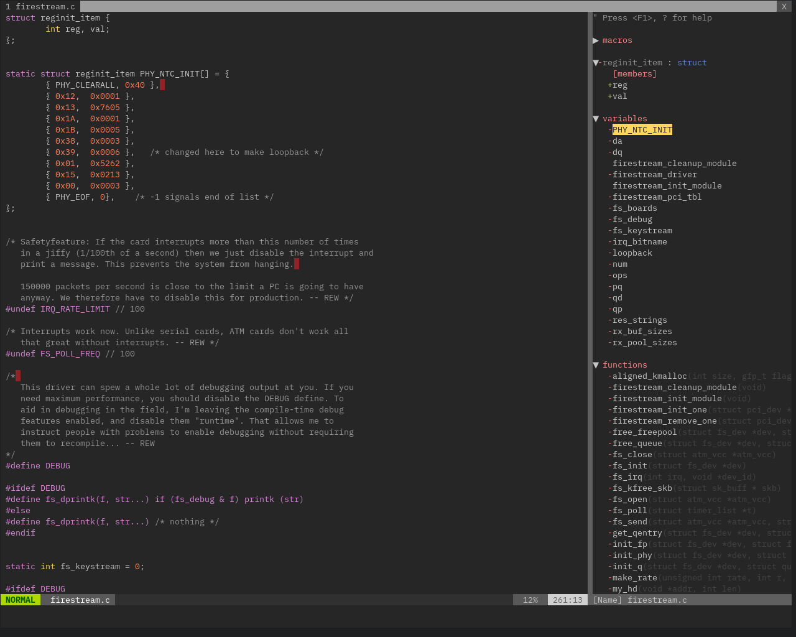
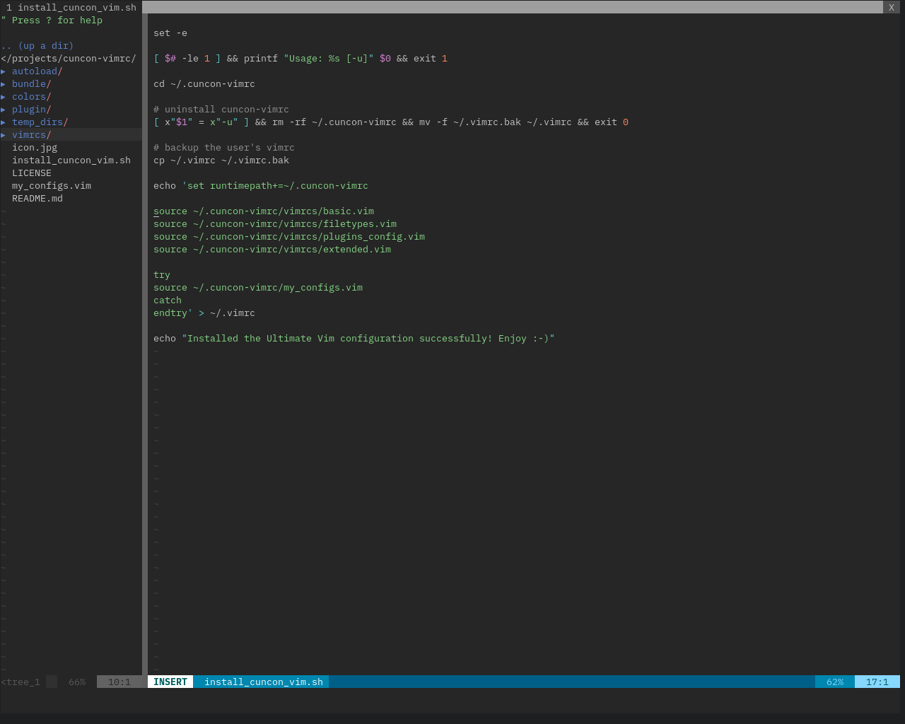
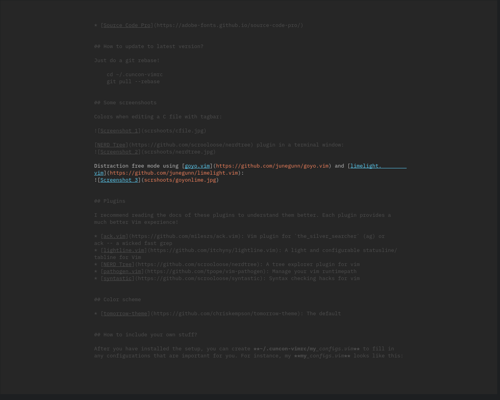

# The lightweight vimrc base on [the ultimate vimrc](https://github.com/amix/vimrc)

## Installation

To install it simply do following from your terminal:

    git clone --depth=1 https://github.com/cuncon/cuncon-vimrc.git ~/.cuncon-vimrc
    sh ~/.cuncon-vimrc/install_cuncon_vimrc.sh

For the first time running vim after installation:
     :PlugInstall

## Fonts

Some good fonts for developers:

* [Source Code Pro](https://adobe-fonts.github.io/source-code-pro/) (recommended)
* [IBM Plex Mono font](https://ibm.github.io/type/)
* [Hack](http://sourcefoundry.org/hack/)

## How to update to latest version?

Just do a git rebase!

    cd ~/.cuncon-vimrc
    git pull --rebase

## Some screenshots

Colors when editing a C file with tagbar:

[NERD Tree](https://github.com/scrooloose/nerdtree) plugin in a terminal window:

Distraction free mode using [goyo.vim](https://github.com/junegunn/goyo.vim) and [limelight.vim](https://github.com/junegunn/limelight.vim):

## Plugins

I recommend reading the docs of these plugins to understand them better. Each plugin provides a much better Vim experience!

* [ack.vim](https://github.com/mileszs/ack.vim): Vim plugin for `the_silver_searcher` (ag) or ack -- a wicked fast grep
* [ctrlp.vim](https://github.com/ctrlpvim/ctrlp.vim): Full path fuzzy file, buffer, mru, tag, ... finder for Vim
* [goyo.vim](https://github.com/junegunn/goyo.vim): Distraction-free writing in Vim
* [limelight.vim](https://github.com/junegunn/limelight.vim): Hyperfocus-writing in Vim
* [lightline.vim](https://github.com/itchyny/lightline.vim): A light and configurable statusline/tabline for Vim
* [NERD Tree](https://github.com/scrooloose/nerdtree): A tree explorer plugin for vim
* [tagbar](https://github.com/majutsushi/tagbar): Displays tags in a window
* [vim-fugitive](https://github.com/tpope/vim-fugitive): A Git wrapper so awesome
* [vim-multi-cursor](https://github.com/terryma/vim-multiple-cursors): True Sublime Text style multiple selections for Vim
* [vim-surround](https://github.com/tpope/vim-surround): quoting/parenthesizing made simple
* [vim-plug](https://github.com/junegunn/vim-plug): Minimalist Vim Plugin Manager

## Color scheme

* [tomorrow-theme](https://github.com/chriskempson/tomorrow-theme)
* [gruvbox](https://github.com/morhetz/gruvbox)
* [papercolor](https://github.com/NLKNguyen/papercolor-theme)

## How to include your own stuff?

After you have installed the setup, you can create **~/.cuncon-vimrc/my_configs.vim** to fill in any configurations that are important for you. For instance, my **my_configs.vim** looks like this:

	~/.cuncon-vimrc (master)> cat my_configs.vim
	map <leader>ct :cd ~/projects/cuncon-vimrc<cr>
	map <leader>cw :cd ~/projects/linux<cr> 

You can also install your plugins, for instance, via vim-plug you can install [vim-rails](https://github.com/tpope/vim-rails) by add some thing like this to ~/.cuncon-vimrc/my_config.vim:

	call plug#begin('~/.cuncon-vimrc/bundle')
	Plug 'tpope/vim-rails'
	call plug#end

## Key Mappings

The [leader](http://learnvimscriptthehardway.stevelosh.com/chapters/06.html#leader) is `,`, so whenever you see `<leader>` it means `,`.

### Plugin related mappings

[NERD Tree](https://github.com/scrooloose/nerdtree) mappings:

    map <leader>nn :NERDTreeToggle<cr>
    map <leader>nb :NERDTreeFromBookmark 
    map <leader>nf :NERDTreeFind<cr>

[goyo.vim](https://github.com/junegunn/goyo.vim) and [limelight.vim](https://github.com/junegunn/limelight.vim) lets you only focus on one thing at a time.

    map <leader>z :Goyo<cr>Limelight0.5<cr>

### Normal mode mappings

Fast saving of a buffer (`<leader>w`):

	nmap <leader>w :w!<cr>
	
Map `<Space>` to `/` (search) and `<Ctrl>+<Space>` to `?` (backwards search):
	
	map <space> /
	map <c-space> ?
	map <silent> <leader><cr> :noh<cr>

Disable highlights when you press `<leader><cr>`:
	
	map <silent> <leader><cr> :noh<cr>

Smart way to move between windows (`<ctrl>j` etc.):
	
	map <C-j> <C-W>j
	map <C-k> <C-W>k
	map <C-h> <C-W>h
	map <C-l> <C-W>l

Closing of the current buffer(s) (`<leader>bd` and (`<leader>ba`)):
	
	" Close current buffer
	map <leader>bd :Bclose<cr>
	
	" Close all buffers
	map <leader>ba :1,1000 bd!<cr>
	
Useful mappings for managing tabs:
	
	map <leader>tn :tabnew<cr>
	map <leader>to :tabonly<cr>
	map <leader>tc :tabclose<cr>
	map <leader>tm :tabmove 
	
	" Opens a new tab with the current buffer's path
	" Super useful when editing files in the same directory
	map <leader>te :tabedit <c-r>=expand("%:p:h")<cr>/
	
Switch [CWD](http://vim.wikia.com/wiki/Set_working_directory_to_the_current_file) to the directory of the open buffer:
	
	map <leader>cd :cd %:p:h<cr>:pwd<cr>
	
Open `ack.vim` for fast search:
	
	map <leader>g :Ack 

Quickly open a buffer for scripbble:
	
	map <leader>q :e ~/buffer<cr>

Toggle paste mode on and off:
	
	map <leader>pp :setlocal paste!<cr>

### Visual mode mappings

Visual mode pressing `*` or `#` searches for the current selection:

	vnoremap <silent> * :call VisualSelection('f')<CR>
	vnoremap <silent> # :call VisualSelection('b')<CR>

When you press gv you `Ack.vim` after the selected text:

	vnoremap <silent> gv :call VisualSelection('gv', '')<CR>

When you press `<leader>r` you can search and replace the selected text:

	vnoremap <silent> <leader>r :call VisualSelection('replace')<CR>

Surround the visual selection in parenthesis/brackets/etc.:

    vnoremap $1 <esc>`>a)<esc>`<i(<esc>
    vnoremap $2 <esc>`>a]<esc>`<i[<esc>
    vnoremap $3 <esc>`>a}<esc>`<i{<esc>
    vnoremap $$ <esc>`>a"<esc>`<i"<esc>
    vnoremap $q <esc>`>a'<esc>`<i'<esc>
    vnoremap $e <esc>`>a"<esc>`<i"<esc>

### Insert mode mappings

Quickly insert parenthesis/brackets/etc.:

    inoremap $1 ()<esc>i
    inoremap $2 []<esc>i
    inoremap $3 {}<esc>i
    inoremap $4 {<esc>o}<esc>O
    inoremap $q ''<esc>i
    inoremap $e ""<esc>i
    inoremap $t <><esc>i

Insert the current date and time (useful for timestamps):

    iab xdate <c-r>=strftime("%d/%m/%y %H:%M:%S")<cr>

### Command line mappings

$q is super useful when browsing on the command line. It deletes everything until the last slash:

    cno $q <C-\>eDeleteTillSlash()<cr>

Bash like keys for the command line:

    cnoremap <C-A>		<Home>
    cnoremap <C-E>		<End>
    cnoremap <C-K>		<C-U>

    cnoremap <C-P> <Up>
    cnoremap <C-N> <Down>

Write the file as sudo (works only on Unix). Super useful when you open a file and you don't have permissions to save your changes. [Vim tip](http://vim.wikia.com/wiki/Su-write):

    :W 

### Spell checking
Pressing `<leader>ss` will toggle spell checking:

    map <leader>ss :setlocal spell!<cr>

Shortcuts using `<leader>` instead of special characters:

    map <leader>sn ]s
    map <leader>sp [s
    map <leader>sa zg
    map <leader>s? z=

### Cope
Query `:help cope` if you are unsure what cope is. It's super useful!

When you search with `Ack.vim`, display your results in cope by doing:
`<leader>cc`

To go to the next search result do:
`<leader>n`

To go to the previous search results do:
`<leader>p`

Cope mappings:

    map <leader>cc :botright cope<cr>
    map <leader>co ggVGy:tabnew<cr>:set syntax=qf<cr>pgg
    map <leader>n :cn<cr>
    map <leader>p :cp<cr>

## How to uninstall
Just do following:
* Remove ~/.cuncon-vimrc
* Restore the old vimrc ~/.vimrc.bak
